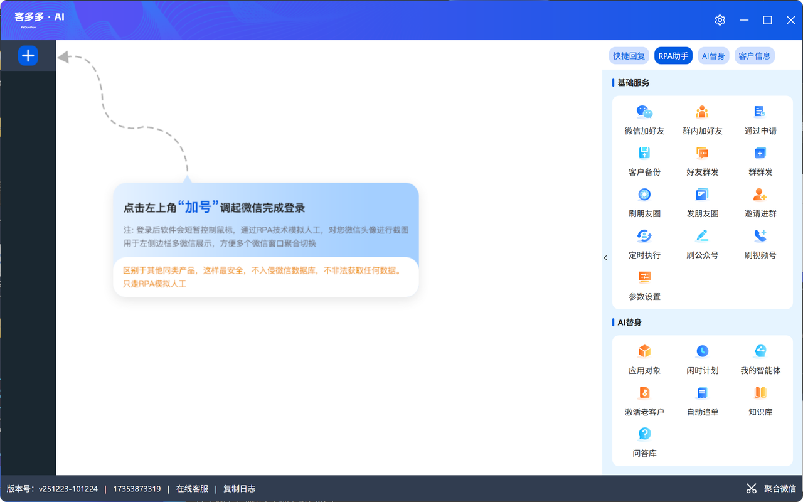
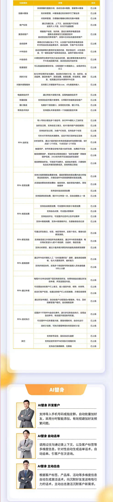

一、产品优势
基于成熟的 RPA 技术，RPA 即机器人流程自动化，融入AI销冠智能体客服、全网首发。
高效智能：RPA 微信营销自动化工具绝非外挂，采用先进的技术和严格的合规流程开发，让您告别因使用外挂导致微信号被封的担忧。完全模拟真人操作电脑，100%不封号！这是最安全的主动加人方法，没有之一！可以添加手机号码、微信号、QQ号、微信群好友；
AI替身：全网首家采用RPA技术+AI智能体，打造你的专属替身，目前已实现个人微信全自动托管/半托管，解放你的双手，提高你的工作效率，借助不同AI智能体工作流，让你成为各个不同领域的专家。
功能丰富：12大RPA功能+AI智能体销冠涵盖多种微信营销场景，模拟人工自动操作，满足不同用户需求。
没客源没数据？：可提供全网实时采集获客软件。可采集全国地图企业各种平台数据，一键导入加好友。
操作便捷：软件界面友好，易于上手使用，1台电脑最大可支持10个微信同时运行。建议单台电脑5个号就好，不容易造成风控！
解放双手：自由设置加人验证语、备注、标签。每个微信独立数据库，添加不重复。中途停止，下次继续从结束位置开始添加；
市场认可：很多人被外挂软件封怕了，慢慢开始知道 RPA 安全，转而使用，在后续使用RPA后没有出现外挂软件封号。
功能重点：
1.全自动和半自动微信托管。
2.支持一个软件同时托管1-个微信号。
3.支持定时群内加好友、导入号码加好友等多种自动加好友。
4.支持自动发信息可好友群发和发群。
5.支持自动发朋友圈，刷朋友圈，朋友圈AI评论。
6.可自动邀请进群，定时任务等操作。
7.支持老客户激活回访、自动追单。
8.自带知识库可通过AI模型自动训练专属AI智能体。
9.可上传问答库，自动回复客户关注问题。
AI私域营销系统，独创各行业自动AI智能体与微信自动托管技术，可快速解放你的双手、代替真人对微信进行自动控制，通过AI技术替代真人24小时接待客户。

二、产品截图
通过RPA技术，RPA全称：机器人流程自动化（Robotic Process Automation），来实现微信营销自动化
涵盖多种微信营销场景，自动执行微信营销任务
100%模拟人工操作，绝非外挂，告别外挂封号的烦恼，功能丰富，即高效便捷也安全无忧

三、功能介绍

四、使用前准备
服务器建议：8核16G10M 最低配置4核8G10M
数据库：mysql5.6 或5.7
硬件与系统要求，不支持手机以及苹果Macbook 系统苹果电脑安装windows可以使用
最低配置：Windows 10/11，4核CPU，8GB内存，256GB SSD硬盘。 
推荐配置：Windows 10/11，8核CPU，16GB内存，1TB SSD硬盘。 
网络：稳定宽带（≥500M），避免使用公共WiFi或频繁切换IP。
演示后台：
https://keduoduo-rpa.llweixin.cn/rpa_manage/agentManage
13333333333  123456
直接下载演示安装包↓↓↓↓↓↓↓↓

软件演示账号密码：13333333333  123456